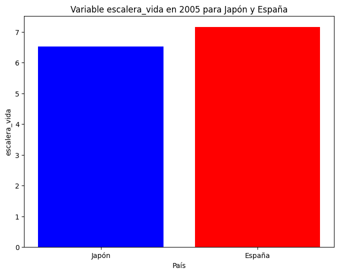
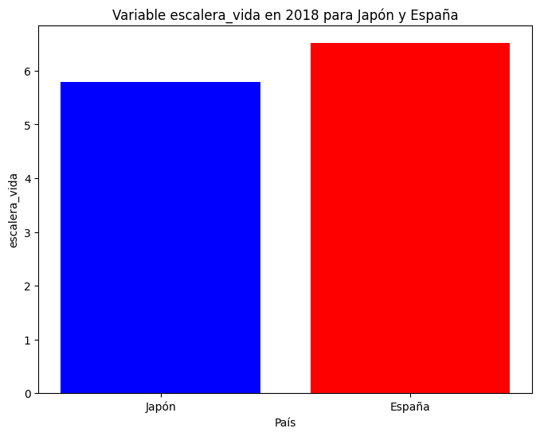

```python
import pandas as pd
```


```python
import numpy as np
```


```python
import matplotlib.pyplot as plt
```


```python
felicidad = pd.read_csv('https://raw.githubusercontent.com/cienciadedatos/datos-de-miercoles/master/datos/2019/2019-08-07/felicidad.csv')
felicidad
```


<div>
<style scoped>
    .dataframe tbody tr th:only-of-type {
        vertical-align: middle;
    }

    .dataframe tbody tr th {
        vertical-align: top;
    }

    .dataframe thead th {
        text-align: right;
    }
</style>
<table border="1" class="dataframe">
  <thead>
    <tr style="text-align: right;">
      <th></th>
      <th>pais</th>
      <th>anio</th>
      <th>escalera_vida</th>
      <th>log_pib</th>
      <th>soporte_social</th>
      <th>expectativa_vida</th>
      <th>libertad</th>
      <th>generosidad</th>
      <th>percepcion_corrupcion</th>
      <th>afecto_positivo</th>
      <th>afecto_negativo</th>
      <th>confianza</th>
      <th>calidad_democracia</th>
      <th>calidad_entrega</th>
      <th>de_escalera_pais_anio</th>
      <th>gini_banco_mundial</th>
      <th>gini_banco_mundial_promedio</th>
    </tr>
  </thead>
  <tbody>
    <tr>
      <th>0</th>
      <td>Afghanistán</td>
      <td>2008</td>
      <td>3.723590</td>
      <td>7.168690</td>
      <td>0.450662</td>
      <td>50.799999</td>
      <td>0.718114</td>
      <td>0.177889</td>
      <td>0.881686</td>
      <td>0.517637</td>
      <td>0.258195</td>
      <td>0.612072</td>
      <td>-1.929690</td>
      <td>-1.655084</td>
      <td>1.774662</td>
      <td>NaN</td>
      <td>NaN</td>
    </tr>
    <tr>
      <th>1</th>
      <td>Afghanistán</td>
      <td>2009</td>
      <td>4.401778</td>
      <td>7.333790</td>
      <td>0.552308</td>
      <td>51.200001</td>
      <td>0.678896</td>
      <td>0.200178</td>
      <td>0.850035</td>
      <td>0.583926</td>
      <td>0.237092</td>
      <td>0.611545</td>
      <td>-2.044093</td>
      <td>-1.635025</td>
      <td>1.722688</td>
      <td>NaN</td>
      <td>NaN</td>
    </tr>
    <tr>
      <th>2</th>
      <td>Afghanistán</td>
      <td>2010</td>
      <td>4.758381</td>
      <td>7.386629</td>
      <td>0.539075</td>
      <td>51.599998</td>
      <td>0.600127</td>
      <td>0.134353</td>
      <td>0.706766</td>
      <td>0.618265</td>
      <td>0.275324</td>
      <td>0.299357</td>
      <td>-1.991810</td>
      <td>-1.617176</td>
      <td>1.878622</td>
      <td>NaN</td>
      <td>NaN</td>
    </tr>
    <tr>
      <th>3</th>
      <td>Afghanistán</td>
      <td>2011</td>
      <td>3.831719</td>
      <td>7.415019</td>
      <td>0.521104</td>
      <td>51.919998</td>
      <td>0.495901</td>
      <td>0.172137</td>
      <td>0.731109</td>
      <td>0.611387</td>
      <td>0.267175</td>
      <td>0.307386</td>
      <td>-1.919018</td>
      <td>-1.616221</td>
      <td>1.785360</td>
      <td>NaN</td>
      <td>NaN</td>
    </tr>
    <tr>
      <th>4</th>
      <td>Afghanistán</td>
      <td>2012</td>
      <td>3.782938</td>
      <td>7.517126</td>
      <td>0.520637</td>
      <td>52.240002</td>
      <td>0.530935</td>
      <td>0.244273</td>
      <td>0.775620</td>
      <td>0.710385</td>
      <td>0.267919</td>
      <td>0.435440</td>
      <td>-1.842996</td>
      <td>-1.404078</td>
      <td>1.798283</td>
      <td>NaN</td>
      <td>NaN</td>
    </tr>
    <tr>
      <th>...</th>
      <td>...</td>
      <td>...</td>
      <td>...</td>
      <td>...</td>
      <td>...</td>
      <td>...</td>
      <td>...</td>
      <td>...</td>
      <td>...</td>
      <td>...</td>
      <td>...</td>
      <td>...</td>
      <td>...</td>
      <td>...</td>
      <td>...</td>
      <td>...</td>
      <td>...</td>
    </tr>
    <tr>
      <th>1699</th>
      <td>Zimbabue</td>
      <td>2014</td>
      <td>4.184451</td>
      <td>7.562753</td>
      <td>0.765839</td>
      <td>52.380001</td>
      <td>0.642034</td>
      <td>-0.048634</td>
      <td>0.820217</td>
      <td>0.725214</td>
      <td>0.239111</td>
      <td>0.566209</td>
      <td>-0.985267</td>
      <td>-1.484067</td>
      <td>2.079248</td>
      <td>NaN</td>
      <td>0.432</td>
    </tr>
    <tr>
      <th>1700</th>
      <td>Zimbabue</td>
      <td>2015</td>
      <td>3.703191</td>
      <td>7.556052</td>
      <td>0.735800</td>
      <td>53.799999</td>
      <td>0.667193</td>
      <td>-0.097354</td>
      <td>0.810457</td>
      <td>0.715079</td>
      <td>0.178861</td>
      <td>0.590012</td>
      <td>-0.893078</td>
      <td>-1.357514</td>
      <td>2.198865</td>
      <td>NaN</td>
      <td>0.432</td>
    </tr>
    <tr>
      <th>1701</th>
      <td>Zimbabue</td>
      <td>2016</td>
      <td>3.735400</td>
      <td>7.538829</td>
      <td>0.768425</td>
      <td>54.400002</td>
      <td>0.732971</td>
      <td>-0.068105</td>
      <td>0.723612</td>
      <td>0.737636</td>
      <td>0.208555</td>
      <td>0.699344</td>
      <td>-0.900649</td>
      <td>-1.374650</td>
      <td>2.776363</td>
      <td>NaN</td>
      <td>0.432</td>
    </tr>
    <tr>
      <th>1702</th>
      <td>Zimbabue</td>
      <td>2017</td>
      <td>3.638300</td>
      <td>7.549491</td>
      <td>0.754147</td>
      <td>55.000000</td>
      <td>0.752826</td>
      <td>-0.069670</td>
      <td>0.751208</td>
      <td>0.806428</td>
      <td>0.224051</td>
      <td>0.682647</td>
      <td>-0.988153</td>
      <td>-1.350867</td>
      <td>2.656848</td>
      <td>NaN</td>
      <td>0.432</td>
    </tr>
    <tr>
      <th>1703</th>
      <td>Zimbabue</td>
      <td>2018</td>
      <td>3.616480</td>
      <td>7.553395</td>
      <td>0.775388</td>
      <td>55.599998</td>
      <td>0.762675</td>
      <td>-0.038384</td>
      <td>0.844209</td>
      <td>0.710119</td>
      <td>0.211726</td>
      <td>0.550508</td>
      <td>NaN</td>
      <td>NaN</td>
      <td>2.498696</td>
      <td>NaN</td>
      <td>0.432</td>
    </tr>
  </tbody>
</table>
<p>1704 rows × 17 columns</p>
</div>


```python
type(felicidad)
```


    pandas.core.frame.DataFrame


```python
felicidad.shape
```


    (1704, 17)


```python
# Primer año del conjunto de datos
primer_anio = felicidad['anio'].min()
```


```python
print("Primer año:", primer_anio)
```

    Primer año: 2005


```python
#Ultimo año del conjunto de datos
ultimo_anio = felicidad['anio'].max()
```


```python
print("Último año:", ultimo_anio)
```

    Último año: 2018


```python
#Medida de tendencia y dispersión para el primer año del conjunto de datos: Año 2005
datos_2005 = felicidad[felicidad['anio'] == 2005]
```


```python
print(resumen_2005)
```

                                        mean       std
    anio                         2005.000000  0.000000
    escalera_vida                   6.446164  0.919143
    log_pib                        10.042106  0.639556
    soporte_social                  0.897367  0.084232
    expectativa_vida               67.007407  4.549719
    libertad                        0.829618  0.105487
    generosidad                     0.244575       NaN
    percepcion_corrupcion           0.715875  0.198793
    afecto_positivo                 0.748566  0.089021
    afecto_negativo                 0.255710  0.064450
    confianza                       0.441193  0.155937
    calidad_democracia              0.385734  0.874296
    calidad_entrega                 0.667317  0.940601
    de_escalera_pais_anio           1.965168  0.386434
    gini_banco_mundial              0.360765  0.093552
    gini_banco_mundial_promedio     0.346632  0.070956


```python
#Ultimo año del conjunto de datos: Año 2018
datos_2018 = felicidad[felicidad['anio'] == 2018]
```


```python
resumen_2018 = datos_2018.describe().loc[['mean', 'std']].T
```


```python
print(resumen_2018)
```

                                        mean       std
    anio                         2018.000000  0.000000
    escalera_vida                   5.502134  1.103461
    log_pib                         9.250394  1.186589
    soporte_social                  0.810544  0.116332
    expectativa_vida               64.670832  6.728247
    libertad                        0.784535  0.117821
    generosidad                    -0.029086  0.156355
    percepcion_corrupcion           0.731744  0.186574
    afecto_positivo                 0.709628  0.111807
    afecto_negativo                 0.293670  0.088841
    confianza                       0.495120  0.201564
    calidad_democracia                   NaN       NaN
    calidad_entrega                      NaN       NaN
    de_escalera_pais_anio           2.276788  0.531355
    gini_banco_mundial                   NaN       NaN
    gini_banco_mundial_promedio     0.386156  0.083415


```python
# Numero de paises 
paises_unicos = felicidad['pais'].drop_duplicates()
```


```python
print("Número de países únicos:", numero_de_paises)
```

    Número de países únicos: 164


```python
numero_de_paises = paises_unicos.shape[0]
for indice, pais in enumerate(paises_unicos, start=1):
    print(f"{indice}. {pais}")
```

    1. Afghanistán
    2. Albania
    3. Algeria
    4. Angola
    5. Argentina
    6. Armenia
    7. Australia
    8. Austria
    9. Azerbaijan
    10. Bahrain
    11. Bangladesh
    12. Bielorrusia
    13. Bélgica
    14. Belize
    15. Benin
    16. Bhutan
    17. Bolivia
    18. Bosnia y Herzegovina
    19. Botswana
    20. Brasil
    21. Bulgaria
    22. Burkina Faso
    23. Burundi
    24. Cambodia
    25. Camerún
    26. Canadá
    27. República Central Africana
    28. Chad
    29. Chile
    30. China
    31. Colombia
    32. Comoros
    33. Congo (Brazzaville)
    34. Congo (Kinshasa)
    35. Costa Rica
    36. Croacia
    37. Cuba
    38. Chipre
    39. República Checa
    40. Dinamarca
    41. Djibouti
    42. República Dominicana
    43. Ecuador
    44. Egipto
    45. El Salvador
    46. Estonia
    47. Etiopía
    48. Finlandia
    49. Francia
    50. Gabón
    51. Gambia
    52. Georgia
    53. Alemania
    54. Ghana
    55. Greece
    56. Guatemala
    57. Guinea
    58. Guyana
    59. Haití
    60. Honduras
    61. Hong Kong S.A.R. of China
    62. Hungría
    63. Islandia
    64. India
    65. Indonesia
    66. Iran
    67. Irak
    68. Irlanda
    69. Israel
    70. Italia
    71. Costa de Marfil
    72. Jamaica
    73. Japón
    74. Jordania
    75. Kazakhstan
    76. Kenia
    77. Kosovo
    78. Kuwait
    79. Kyrgyzstan
    80. Laos
    81. Latvia
    82. Líbano
    83. Lesotho
    84. Liberia
    85. Libya
    86. Lituania
    87. Luxemburgo
    88. Macedonia
    89. Madagascar
    90. Malawi
    91. Malasia
    92. Mali
    93. Malta
    94. Mauritania
    95. Mauritius
    96. México
    97. Moldova
    98. Mongolia
    99. Montenegro
    100. Marruecos
    101. Mozambique
    102. Myanmar
    103. Namibia
    104. Nepal
    105. Países Bajos
    106. Nueva Zelanda
    107. Nicaragua
    108. Nigeria
    109. North Cyprus
    110. Noruega
    111. Oman
    112. Pakistan
    113. Palestinian Territories
    114. Panamá
    115. Paraguay
    116. Perú
    117. Filipinas
    118. Polonia
    119. Portugal
    120. Qatar
    121. Rumania
    122. Rusia
    123. Ruanda
    124. Arabia Saudita
    125. Senegal
    126. Serbia
    127. Sierra Leona
    128. Singapur
    129. Eslovaquia
    130. Eslovenia
    131. Somalía
    132. Somaliland region
    133. Sudáfrica
    134. Corea del Sur
    135. South Sudan
    136. España
    137. Sri Lanka
    138. Sudan
    139. Surinam
    140. Swaziland
    141. Suecia
    142. Suiza
    143. Syria
    144. Taiwán
    145. Tajikistan
    146. Tanzania
    147. Tailandia
    148. Togo
    149. Trinidad y Tobago
    150. Túnez
    151. Turquía
    152. Turkmenistan
    153. Uganda
    154. Ucrania
    155. Emiratos Árabes Unidos
    156. Reino Unido
    157. Estados Unidos
    158. Uruguay
    159. Uzbekistan
    160. Venezuela
    161. Vietnam
    162. Yemen
    163. Zambia
    164. Zimbabue


```python
# Datos para Japón
Japón = felicidad[felicidad['pais'] == 'Japón']
Japón
```


<div>
<style scoped>
    .dataframe tbody tr th:only-of-type {
        vertical-align: middle;
    }

    .dataframe tbody tr th {
        vertical-align: top;
    }

    .dataframe thead th {
        text-align: right;
    }
</style>
<table border="1" class="dataframe">
  <thead>
    <tr style="text-align: right;">
      <th></th>
      <th>pais</th>
      <th>anio</th>
      <th>escalera_vida</th>
      <th>log_pib</th>
      <th>soporte_social</th>
      <th>expectativa_vida</th>
      <th>libertad</th>
      <th>generosidad</th>
      <th>percepcion_corrupcion</th>
      <th>afecto_positivo</th>
      <th>afecto_negativo</th>
      <th>confianza</th>
      <th>calidad_democracia</th>
      <th>calidad_entrega</th>
      <th>de_escalera_pais_anio</th>
      <th>gini_banco_mundial</th>
      <th>gini_banco_mundial_promedio</th>
    </tr>
  </thead>
  <tbody>
    <tr>
      <th>738</th>
      <td>Japón</td>
      <td>2005</td>
      <td>6.515817</td>
      <td>10.481733</td>
      <td>0.927712</td>
      <td>73.199997</td>
      <td>0.867779</td>
      <td>NaN</td>
      <td>0.698930</td>
      <td>0.738980</td>
      <td>0.153151</td>
      <td>0.350331</td>
      <td>1.021167</td>
      <td>1.251155</td>
      <td>1.788299</td>
      <td>NaN</td>
      <td>0.321</td>
    </tr>
    <tr>
      <th>739</th>
      <td>Japón</td>
      <td>2007</td>
      <td>6.238198</td>
      <td>10.510457</td>
      <td>0.938148</td>
      <td>73.440002</td>
      <td>0.796054</td>
      <td>-0.101111</td>
      <td>0.809233</td>
      <td>0.731494</td>
      <td>0.206580</td>
      <td>0.240006</td>
      <td>0.989995</td>
      <td>1.287541</td>
      <td>1.989094</td>
      <td>NaN</td>
      <td>0.321</td>
    </tr>
    <tr>
      <th>740</th>
      <td>Japón</td>
      <td>2008</td>
      <td>5.910679</td>
      <td>10.498977</td>
      <td>0.887304</td>
      <td>73.559998</td>
      <td>0.772070</td>
      <td>-0.146090</td>
      <td>0.816475</td>
      <td>0.779842</td>
      <td>0.190774</td>
      <td>0.221201</td>
      <td>0.921506</td>
      <td>1.311801</td>
      <td>1.925752</td>
      <td>0.321</td>
      <td>0.321</td>
    </tr>
    <tr>
      <th>741</th>
      <td>Japón</td>
      <td>2009</td>
      <td>5.844999</td>
      <td>10.443416</td>
      <td>0.888357</td>
      <td>73.680000</td>
      <td>0.729888</td>
      <td>-0.220759</td>
      <td>0.740108</td>
      <td>0.784990</td>
      <td>0.169478</td>
      <td>0.251778</td>
      <td>0.998391</td>
      <td>1.305969</td>
      <td>1.855513</td>
      <td>NaN</td>
      <td>0.321</td>
    </tr>
    <tr>
      <th>742</th>
      <td>Japón</td>
      <td>2010</td>
      <td>6.056753</td>
      <td>10.484299</td>
      <td>0.901925</td>
      <td>73.800003</td>
      <td>0.771722</td>
      <td>-0.151214</td>
      <td>0.769557</td>
      <td>0.827118</td>
      <td>0.187703</td>
      <td>0.270271</td>
      <td>0.960023</td>
      <td>1.358310</td>
      <td>1.978432</td>
      <td>NaN</td>
      <td>0.321</td>
    </tr>
    <tr>
      <th>743</th>
      <td>Japón</td>
      <td>2011</td>
      <td>6.262794</td>
      <td>10.484996</td>
      <td>0.916704</td>
      <td>73.980003</td>
      <td>0.814396</td>
      <td>-0.062773</td>
      <td>0.733799</td>
      <td>0.775717</td>
      <td>0.181055</td>
      <td>0.231064</td>
      <td>1.033113</td>
      <td>1.356334</td>
      <td>1.987437</td>
      <td>NaN</td>
      <td>0.321</td>
    </tr>
    <tr>
      <th>744</th>
      <td>Japón</td>
      <td>2012</td>
      <td>5.968216</td>
      <td>10.501433</td>
      <td>0.905295</td>
      <td>74.160004</td>
      <td>0.752832</td>
      <td>NaN</td>
      <td>0.692387</td>
      <td>0.776911</td>
      <td>0.171475</td>
      <td>0.169178</td>
      <td>1.024869</td>
      <td>1.386078</td>
      <td>1.902084</td>
      <td>NaN</td>
      <td>0.321</td>
    </tr>
    <tr>
      <th>745</th>
      <td>Japón</td>
      <td>2013</td>
      <td>5.959362</td>
      <td>10.522681</td>
      <td>0.923688</td>
      <td>74.339996</td>
      <td>0.821417</td>
      <td>-0.157917</td>
      <td>0.650498</td>
      <td>0.793809</td>
      <td>0.174622</td>
      <td>0.358107</td>
      <td>1.064394</td>
      <td>1.458361</td>
      <td>1.905620</td>
      <td>NaN</td>
      <td>0.321</td>
    </tr>
    <tr>
      <th>746</th>
      <td>Japón</td>
      <td>2014</td>
      <td>5.922621</td>
      <td>10.527748</td>
      <td>0.900040</td>
      <td>74.519997</td>
      <td>0.838052</td>
      <td>-0.150382</td>
      <td>0.617483</td>
      <td>0.741508</td>
      <td>0.189433</td>
      <td>0.379515</td>
      <td>1.002343</td>
      <td>1.562861</td>
      <td>1.893251</td>
      <td>NaN</td>
      <td>0.321</td>
    </tr>
    <tr>
      <th>747</th>
      <td>Japón</td>
      <td>2015</td>
      <td>5.879684</td>
      <td>10.542257</td>
      <td>0.922657</td>
      <td>74.699997</td>
      <td>0.831694</td>
      <td>-0.166381</td>
      <td>0.654443</td>
      <td>0.768091</td>
      <td>0.176409</td>
      <td>0.352867</td>
      <td>1.026557</td>
      <td>1.522612</td>
      <td>1.807609</td>
      <td>NaN</td>
      <td>0.321</td>
    </tr>
    <tr>
      <th>748</th>
      <td>Japón</td>
      <td>2016</td>
      <td>5.954651</td>
      <td>10.552749</td>
      <td>0.899774</td>
      <td>74.800003</td>
      <td>0.836065</td>
      <td>-0.073620</td>
      <td>0.697639</td>
      <td>0.760109</td>
      <td>0.192403</td>
      <td>0.362201</td>
      <td>0.985401</td>
      <td>1.549104</td>
      <td>1.898953</td>
      <td>NaN</td>
      <td>0.321</td>
    </tr>
    <tr>
      <th>749</th>
      <td>Japón</td>
      <td>2017</td>
      <td>5.910676</td>
      <td>10.571374</td>
      <td>0.881961</td>
      <td>74.900002</td>
      <td>0.849397</td>
      <td>-0.217277</td>
      <td>0.659199</td>
      <td>0.740388</td>
      <td>0.175512</td>
      <td>0.412490</td>
      <td>1.064278</td>
      <td>1.519917</td>
      <td>1.950257</td>
      <td>NaN</td>
      <td>0.321</td>
    </tr>
    <tr>
      <th>750</th>
      <td>Japón</td>
      <td>2018</td>
      <td>5.793575</td>
      <td>10.581618</td>
      <td>0.886432</td>
      <td>75.000000</td>
      <td>0.773472</td>
      <td>-0.272972</td>
      <td>0.686785</td>
      <td>0.703355</td>
      <td>0.185300</td>
      <td>0.384880</td>
      <td>NaN</td>
      <td>NaN</td>
      <td>1.916026</td>
      <td>NaN</td>
      <td>0.321</td>
    </tr>
  </tbody>
</table>
</div>


```python
# Datos para España
España = felicidad[felicidad['pais'] == 'España']
España
```


<div>
<style scoped>
    .dataframe tbody tr th:only-of-type {
        vertical-align: middle;
    }

    .dataframe tbody tr th {
        vertical-align: top;
    }

    .dataframe thead th {
        text-align: right;
    }
</style>
<table border="1" class="dataframe">
  <thead>
    <tr style="text-align: right;">
      <th></th>
      <th>pais</th>
      <th>anio</th>
      <th>escalera_vida</th>
      <th>log_pib</th>
      <th>soporte_social</th>
      <th>expectativa_vida</th>
      <th>libertad</th>
      <th>generosidad</th>
      <th>percepcion_corrupcion</th>
      <th>afecto_positivo</th>
      <th>afecto_negativo</th>
      <th>confianza</th>
      <th>calidad_democracia</th>
      <th>calidad_entrega</th>
      <th>de_escalera_pais_anio</th>
      <th>gini_banco_mundial</th>
      <th>gini_banco_mundial_promedio</th>
    </tr>
  </thead>
  <tbody>
    <tr>
      <th>1399</th>
      <td>España</td>
      <td>2005</td>
      <td>7.152786</td>
      <td>10.401288</td>
      <td>0.961043</td>
      <td>71.500000</td>
      <td>0.916165</td>
      <td>NaN</td>
      <td>0.777272</td>
      <td>0.775784</td>
      <td>0.240643</td>
      <td>0.527846</td>
      <td>0.663309</td>
      <td>1.319199</td>
      <td>1.724895</td>
      <td>0.324</td>
      <td>0.345385</td>
    </tr>
    <tr>
      <th>1400</th>
      <td>España</td>
      <td>2007</td>
      <td>6.994615</td>
      <td>10.443765</td>
      <td>0.956859</td>
      <td>72.059998</td>
      <td>0.782082</td>
      <td>-0.097476</td>
      <td>0.783718</td>
      <td>0.763125</td>
      <td>0.263593</td>
      <td>0.476249</td>
      <td>0.423869</td>
      <td>1.115818</td>
      <td>1.945701</td>
      <td>0.341</td>
      <td>0.345385</td>
    </tr>
    <tr>
      <th>1401</th>
      <td>España</td>
      <td>2008</td>
      <td>7.294473</td>
      <td>10.438926</td>
      <td>0.948270</td>
      <td>72.339996</td>
      <td>0.833786</td>
      <td>-0.153768</td>
      <td>0.683210</td>
      <td>0.772095</td>
      <td>0.259691</td>
      <td>0.579760</td>
      <td>0.402238</td>
      <td>1.139711</td>
      <td>1.791767</td>
      <td>0.342</td>
      <td>0.345385</td>
    </tr>
    <tr>
      <th>1402</th>
      <td>España</td>
      <td>2009</td>
      <td>6.198601</td>
      <td>10.393677</td>
      <td>0.929454</td>
      <td>72.620003</td>
      <td>0.748515</td>
      <td>-0.131540</td>
      <td>0.797705</td>
      <td>0.752165</td>
      <td>0.335877</td>
      <td>0.424362</td>
      <td>0.351598</td>
      <td>1.089973</td>
      <td>2.077124</td>
      <td>0.349</td>
      <td>0.345385</td>
    </tr>
    <tr>
      <th>1403</th>
      <td>España</td>
      <td>2010</td>
      <td>6.188262</td>
      <td>10.389214</td>
      <td>0.949940</td>
      <td>72.900002</td>
      <td>0.796496</td>
      <td>-0.142079</td>
      <td>0.839746</td>
      <td>0.724312</td>
      <td>0.321819</td>
      <td>0.302732</td>
      <td>0.402250</td>
      <td>1.107106</td>
      <td>1.995816</td>
      <td>0.352</td>
      <td>0.345385</td>
    </tr>
    <tr>
      <th>1404</th>
      <td>España</td>
      <td>2011</td>
      <td>6.518249</td>
      <td>10.375623</td>
      <td>0.944444</td>
      <td>73.019997</td>
      <td>0.818651</td>
      <td>-0.125660</td>
      <td>0.845543</td>
      <td>0.737269</td>
      <td>0.356102</td>
      <td>0.308663</td>
      <td>0.553485</td>
      <td>1.098814</td>
      <td>1.955991</td>
      <td>0.357</td>
      <td>0.345385</td>
    </tr>
    <tr>
      <th>1405</th>
      <td>España</td>
      <td>2012</td>
      <td>6.290690</td>
      <td>10.345259</td>
      <td>0.937023</td>
      <td>73.139999</td>
      <td>0.754586</td>
      <td>-0.063267</td>
      <td>0.843593</td>
      <td>0.749277</td>
      <td>0.366474</td>
      <td>0.339147</td>
      <td>0.517331</td>
      <td>1.066682</td>
      <td>2.038799</td>
      <td>0.354</td>
      <td>0.345385</td>
    </tr>
    <tr>
      <th>1406</th>
      <td>España</td>
      <td>2013</td>
      <td>6.150027</td>
      <td>10.331331</td>
      <td>0.928640</td>
      <td>73.260002</td>
      <td>0.759356</td>
      <td>-0.105051</td>
      <td>0.915823</td>
      <td>0.696296</td>
      <td>0.371839</td>
      <td>0.184550</td>
      <td>0.500444</td>
      <td>1.004294</td>
      <td>2.076716</td>
      <td>0.362</td>
      <td>0.345385</td>
    </tr>
    <tr>
      <th>1407</th>
      <td>España</td>
      <td>2014</td>
      <td>6.456478</td>
      <td>10.348026</td>
      <td>0.947864</td>
      <td>73.379997</td>
      <td>0.738472</td>
      <td>-0.031811</td>
      <td>0.853888</td>
      <td>0.716266</td>
      <td>0.335460</td>
      <td>0.210620</td>
      <td>0.618424</td>
      <td>0.873172</td>
      <td>1.761918</td>
      <td>0.361</td>
      <td>0.345385</td>
    </tr>
    <tr>
      <th>1408</th>
      <td>España</td>
      <td>2015</td>
      <td>6.380663</td>
      <td>10.382548</td>
      <td>0.956472</td>
      <td>73.500000</td>
      <td>0.732000</td>
      <td>-0.075814</td>
      <td>0.821665</td>
      <td>0.732269</td>
      <td>0.284694</td>
      <td>0.277751</td>
      <td>0.648125</td>
      <td>0.866850</td>
      <td>1.658345</td>
      <td>0.362</td>
      <td>0.345385</td>
    </tr>
    <tr>
      <th>1409</th>
      <td>España</td>
      <td>2016</td>
      <td>6.318612</td>
      <td>10.413924</td>
      <td>0.941737</td>
      <td>73.800003</td>
      <td>0.768174</td>
      <td>-0.051831</td>
      <td>0.818559</td>
      <td>0.652816</td>
      <td>0.300829</td>
      <td>0.302517</td>
      <td>0.727093</td>
      <td>0.904802</td>
      <td>1.606150</td>
      <td>NaN</td>
      <td>0.345385</td>
    </tr>
    <tr>
      <th>1410</th>
      <td>España</td>
      <td>2017</td>
      <td>6.230173</td>
      <td>10.442095</td>
      <td>0.903158</td>
      <td>74.099998</td>
      <td>0.755561</td>
      <td>-0.036033</td>
      <td>0.791269</td>
      <td>0.625056</td>
      <td>0.302388</td>
      <td>0.269586</td>
      <td>0.648078</td>
      <td>0.869334</td>
      <td>1.805722</td>
      <td>NaN</td>
      <td>0.345385</td>
    </tr>
    <tr>
      <th>1411</th>
      <td>España</td>
      <td>2018</td>
      <td>6.513371</td>
      <td>10.465594</td>
      <td>0.910315</td>
      <td>74.400002</td>
      <td>0.722251</td>
      <td>-0.079351</td>
      <td>0.776504</td>
      <td>0.659188</td>
      <td>0.357191</td>
      <td>0.285196</td>
      <td>NaN</td>
      <td>NaN</td>
      <td>1.667077</td>
      <td>NaN</td>
      <td>0.345385</td>
    </tr>
  </tbody>
</table>
</div>


```python
import matplotlib.pyplot as plt
```


```python
datos_japon_espana_2005 = felicidad[(felicidad['anio'] == 2005) & (felicidad['pais'].isin(['Japón', 'España']))]
```


```python
variable = 'escalera_vida'
colores = {'Japón': 'blue', 'España': 'red'}
```


```python
plt.figure(figsize=(8, 6))  
plt.bar(datos_japon_espana_2005['pais'], datos_japon_espana_2005[variable], color=[colores[pais] for pais in datos_japon_espana_2005['pais']])
plt.xlabel('País')
plt.ylabel(variable)
plt.title(f'Variable {variable} en 2005 para Japón y España')
plt.xticks(rotation=0)  
```


    ([0, 1], [Text(0, 0, 'Japón'), Text(1, 0, 'España')])


    

    


```python
datos_japon_espana_2018 = felicidad[(felicidad['anio'] == 2018) & (felicidad['pais'].isin(['Japón', 'España']))]
```


```python
plt.figure(figsize=(8, 6)) 
plt.bar(datos_japon_espana_2018['pais'], datos_japon_espana_2018[variable], color=[colores[pais] for pais in datos_japon_espana_2018['pais']])
plt.xlabel('País')
plt.ylabel(variable)
plt.title(f'Variable {variable} en 2018 para Japón y España')
plt.xticks(rotation=0)  
```


    ([0, 1], [Text(0, 0, 'Japón'), Text(1, 0, 'España')])


    

    


```python

```


```python

```
